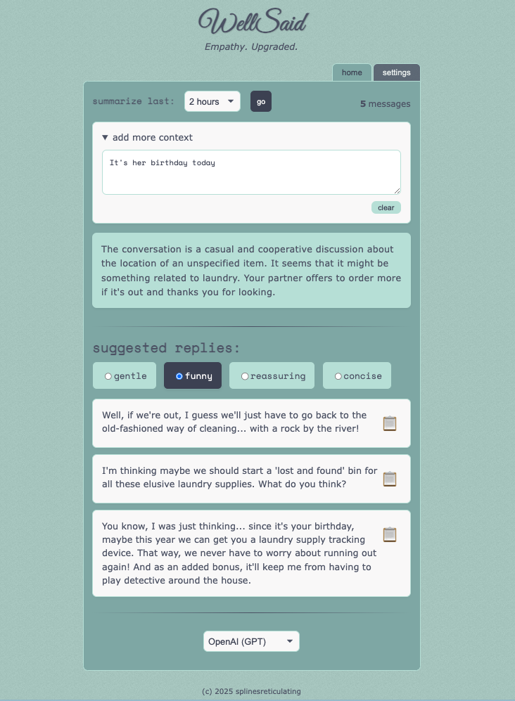
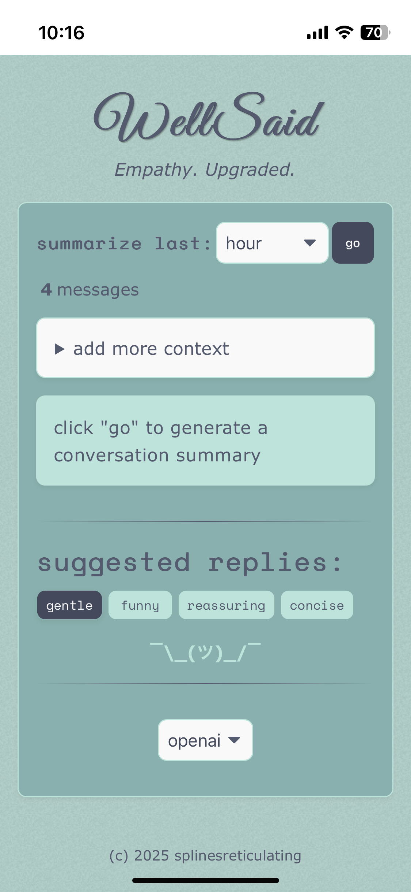

<div align="center">
  
  <h1 align="center">WellSaid</h1>
  <h3 align="center">Empathy. Upgraded.</h3>
  <p align="center">


  </p>

  <p align="center">WellSaid helps you communicate with more empathy and clarity by offering conversation summaries and tone-based reply suggestions.</p>

  <hr>
</div>

## Table of Contents

- [Features](#features)
- [Getting Started](#getting-started)
- [Usage](#usage)
- [How It Works](#how-it-works)
- [Technical Details](#technical-details)
- [Development and Local Usage](#development-and-local-usage)
- [Accessing from Anywhere](#accessing-from-anywhere)
- [iOS Home Screen Icons (and HTTPS Gotchas)](#ios-home-screen-icons-and-https-gotchas)
- [Troubleshooting](#troubleshooting)
- [Acknowledgements](#acknowledgements)
- [Box Art](#box-art)
- [Screenshots](#screenshots)
- [Contributing](#contributing)
- [License](#license)

## Features

- **Conversation Summaries**: Analyze your Apple iMessages app conversations with a partner from the last 1-24 hours
- **Smart Reply Suggestions**: Get short, medium, and long AI-generated reply options based on recent and and historical conversation context
- **Tone Selection**: Set the tone for your replies with (eg: gentle, funny, reassuring, concise)
- **Context Addition**: Add additional context to help generate more relevant replies
- **Message Database Integration**: Connects to your macOS Messages app database

## Getting Started

### Requirements

- iMessages database access -- designed to run from a Mac logged into your iCloud
- API key from OpenAI or Anthropic, or a local [Khoj](https://khoj.dev/) instance

### Obtaining an OpenAI API Key

To use WellSaid with OpenAI's models, you'll need an API key. Here's how to get one:

1. **Sign up for an account**
    - Go to [OpenAI's website](https://platform.openai.com/signup)
    - Create an account or sign in if you already have one
2. **Access the API key section**
    - After logging in, click on your profile icon in the top-right corner
    - Select "View API keys" from the dropdown menu
3. **Create a new secret key**
    - Click on "Create new secret key"
    - Give your key a name (e.g., "WellSaid Development")
    - Click "Create secret key"
    - **Important**: Copy the key immediately - you won't be able to see it again!
4. **Add the key to your environment**
    - Paste the key as the value for `OPENAI_API_KEY` in your `.env` file

**Note**: OpenAI API usage is not free. You'll be charged based on the number of tokens processed. Check [OpenAI's pricing page](https://openai.com/pricing) for current rates.

### Installation

1. Clone the repository

```bash
git clone https://github.com/splinesreticulating/WellSaid.git
cd WellSaid
```

2. Install dependencies

```bash
yarn install
```

3. Generate SvelteKit types (required for testing)

```bash
yarn prepare
```

4. Configure environment variables

```bash
cp .env.example .env
```

Update the values in the `.env` file. The following variables are needed:

- **Customization**

    - `PARTNER_PHONE`: Your partner's phone number in the Messages app
    - `HISTORY_LOOKBACK_HOURS`: How many hours of prior conversation history to search for extra context
    - `CUSTOM_CONTEXT`: To guide the AI's personality and behavior (Example: "Act as my therapist suggesting replies to my partner" or "You are a helpful assistant")

- **Open AI**

    - `OPENAI_API_KEY`: Your OpenAI API key
    - `OPENAI_MODEL`: gpt-4 or any other OpenAI model
    - `OPENAI_TEMPERATURE`: Controls the randomness of the responses
    - `OPENAI_TOP_P`: Lets the responses be a little more adventurous
    - `OPENAI_FREQUENCY_PENALTY`: Keeps the suggestions from repeating themselves
    - `OPENAI_PRESENCE_PENALTY`: Nudges the AI to bring up fresh ideas

- **Anthropic**

    - `ANTHROPIC_API_KEY`: Your Anthropic API key
    - `ANTHROPIC_MODEL`: claude-3-opus-20240229 or another Anthropic model
    - `ANTHROPIC_TEMPERATURE`: Controls the randomness of Claude's responses

- **Khoj**

    - `KHOJ_API_URL`: Your [Khoj](https://khoj.dev/) server API URL if you have one, otherwise leave this out or leave it blank
    - `KHOJ_AGENT`: The [Khoj agent](https://docs.khoj.dev/features/agents/) to use if you have one, otherwise leave this out or leave it blank

- **Logging**

    - `LOG_LEVEL`: Logging level (info, debug, warn, error)

- **Remote Access**

    - `ALLOWED_HOST`: For remote access via Tailscale (see 'Accessing from Anywhere' below) -- leave blank or set to 'all' if you don't need access from outside your local network

- **Security**
    - `APP_USERNAME`: Your username
    - `APP_PASSWORD`: Your password
    - `JWT_SECRET`: Should be a long, random, and unpredictable string.
      You can generate one using OpenSSL with the following command in your terminal:
    ```bash
    openssl rand -base64 64
    ```
    - Copy the output of this command and use it as the value for `JWT_SECRET` in your `.env` file. Ensure it's on a single line.

5. Start the development server

```bash
yarn dev
```

The server will run over HTTP by default. If you place `cert.pem` and
`key.pem` in a `.certs` directory at the project root (see the HTTPS section
below), it will automatically use those files and start with HTTPS.

## Usage

1. Select a time frame to analyze
1. Choose a tone for the reply suggestions
1. Click "go" to generate a conversation summary and some suggested replies of varying length
1. Copy and paste a suggested reply into your conversation

## How It Works

WellSaid connects to your macOS Messages database to fetch your conversations with a specific contact (set via the `PARTNER_PHONE` environment variable). It then uses an AI provider (any combination of OpenAI, Anthropic, and/or Khoj) to analyze the conversation and generate:

1. A summary of the conversation, including emotional tone and key topics
1. Three suggested replies (short, medium, and long) in your chosen tone

## Technical Details

- **Frontend**: Svelte 5 with SvelteKit
- **State Management**: Svelte's built-in $state system
- **Styling**: Custom CSS with variables for theming
- **Database**: SQLite (connecting to macOS Messages database)
- **AI Integration**: OpenAI API (GPT-4 or other models), Anthropic Claude models, and/or local [Khoj](https://khoj.dev/) server
- **Logging**: Pino for structured logging

## Development and Local Usage

```bash
# Install dependencies first
yarn install
yarn prepare

# Run in development mode with hot-reloading
yarn dev

# Lint code
yarn lint

# Format code
yarn format

# Build optimized version
yarn build

# Run the optimized build locally
yarn preview

# Run tests
yarn test

# Run tests with watch mode
yarn test:watch

# Run tests with coverage report
yarn test:coverage
```

**Note**: Since this application only runs on macOS and accesses local system resources, there is no traditional "production deployment" - the built version is simply run locally on your Mac. The `yarn build` and `yarn preview` commands create and run an optimized version that may provide better performance than development mode.

## Accessing from Anywhere

If you'd like to securely access WellSaid remotely, use [Tailscale](https://tailscale.com) to set up a secure private network that connects your devices.

Once your Tailscale network is set up, all that's required in the app is that you set the `ALLOWED_HOST` variable in your `.env` file to the address provided by Tailscale. For more details, visit [Tailscale's documentation](https://tailscale.com/kb/).

### iOS Home Screen Icons (and HTTPS Gotchas)

To make your WellSaid app look great when saved to your iPhone's Home Screen, iOS requires a **valid HTTPS certificate**. This step is optional—if you just want to run the app locally in a browser, you can skip it and use plain HTTP.

1. **Install mkcert (if not already installed)**

```bash
brew install mkcert
mkcert -install
```

2. **Generate a local trusted cert and run your app with HTTPS**

```bash
mkcert <your-tailscale-hostname>.<tailscale-subdomain>.ts.net localhost
```

This will create a cert/key pair like `rootCA.pem` and `rootCA-key.pem`.
Move the generated certificate files into a `.certs` directory at the project
root so the development server can automatically find them.

3. **Trust the cert on your iPhone**

- Convert the root CA to iOS-compatible format:

```bash
openssl x509 -inform PEM -in "$(mkcert -CAROOT)/rootCA.pem" -outform DER -out mkcert-rootCA.cer
```

- AirDrop or email the `mkcert-rootCA.cer` file to your iPhone
- Open it, then go to:
    - **Settings → General → VPN & Device Management → Install Profile**
    - **Settings → General → About → Certificate Trust Settings → Enable full trust** for mkcert root

Now when you visit your app over HTTPS (via Safari), iOS will trust the cert, and your manifest and icon will load properly — giving your app a real custom icon when added to the Home Screen.

## Privacy and Security Considerations

- All conversation analysis happens through the selected AI provider (OpenAI, Anthropic, or Khoj), so your data is subject to that provider's privacy policy.

## Troubleshooting

### Common Issues

- **0 Messages Found**: Open the Messages app on your Mac and sign in if you haven't already. Summaries and replies will be available once you've signed in and your partner has sent at least one message.
- **Messages Not Loading**: Ensure you've set the correct `PARTNER_PHONE` in your `.env` file.
- **Permission Issues**: WellSaid needs access to your Messages database. Make sure Terminal/your editor has Full Disk Access in System Preferences > Security & Privacy.
- **Go Button Disabled**: Conversation summaries are only available when your partner has responded in the selected time frame.

## Acknowledgements

- [Svelte](https://svelte.dev/) - The web framework used
- [OpenAI](https://openai.com/) - AI model provider
- [Anthropic](https://www.anthropic.com/) - Claude model provider
- [Khoj](https://khoj.dev/) - Alternative local AI model provider and search
- [SQLite](https://sqlite.org/) - Database engine
- [Tailscale](https://tailscale.com/) - For making secure remote access easy

## Box Art

<p align="center" style="display: flex; gap: 20px; justify-content: center;">
  
  
</p>

## Screenshots

<table>
  <tr>
    <td align="center">
      <h4>Desktop</h4>
      
    </td>
    <td align="center">
      <h4>Mobile</h4>
      
    </td>
  </tr>
</table>

## Contributing

Feel free to submit a pull request or open an issue if you find a bug or have a feature you'd like to add.

## License

This project is licensed under the MIT License - see the LICENSE file for details.
